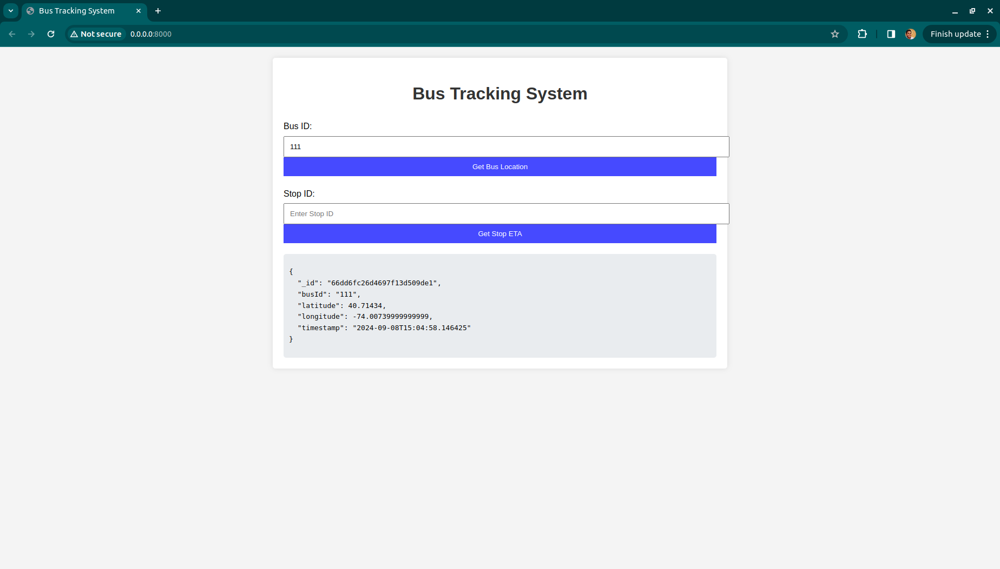

# TransitTracker
TransitTracker is a real-time bus tracking system designed to monitor and predict the locations and estimated arrival times (ETAs) of buses within an urban environment.Leveraging modern technologies such as FastAPI, MongoDB, Kafka, and a simple frontend interface, TransitTracker provides an efficient and scalable solution for transit authorities and passengers to keep track of bus movements and schedules.

## Table of Contents
- [Overview](#overview)
- [Features](#features)
- [Technologies Used](#technologies-used)
- [Architecture](#architecture)
- [Getting Started](#getting-started)
  - [Prerequisites](#prerequisites)
  - [Installation](#installation)
  - [Running the Application](#running-the-application)
- [Usage](#usage)
- [Project Structure](#project-structure)

## Overview
TransitTracker is a real-time bus tracking system designed to monitor and predict the locations and estimated arrival times (ETAs) of buses within an urban environment. It leverages modern technologies like FastAPI, MongoDB, Kafka, and a user-friendly frontend interface to provide efficient and scalable solutions for transit authorities and passengers.

## Features
- **Real-Time Bus Location Tracking:** Retrieve live locations of buses by their IDs.
- **Estimated Arrival Time (ETA) Calculation:** Get ETAs for buses at specific stops based on their current positions.
- **Simulated GPS Data:** Generate and publish realistic bus movement data for testing and demonstration.
- **Scalable Architecture:** Utilize Kafka for handling high-throughput data streams and MongoDB for efficient data storage.
- **User-Friendly Interface:** Simple web interface for interacting with the system.


## Technologies Used

### Backend:
- FastAPI
- MongoDB
- Pymongo
- Kafka
- Kafka-Python
- Uvicorn

### Frontend:
- HTML, CSS, JavaScript

### Other:
- Python 3.7+
- Git


## Architecture
The TransitTracker system is composed of the following components:
- **API Server (`api.py`):** Handles HTTP requests, serves the frontend, and interacts with MongoDB.
- **ETA Processor (`eta.py`):** Consumes bus location data from Kafka, calculates ETAs, and stores them in MongoDB.
- **GPS Data Simulator (`gps_data_simulator.py`):** Simulates bus movements by publishing GPS data to Kafka.
- **Frontend Interface (`/static/index.html`):** Provides a web interface for users to query bus locations and ETAs.
- **Database (MongoDB):** Stores bus location data and ETA predictions.
- **Message Broker (Kafka):** Facilitates real-time data streaming between components.

### Here's a screenshot of the TransitTracker interface:
#### Bus Status Image


#### ETA 


## Getting Started

### Prerequisites
- Python 3.7+
- MongoDB: Ensure MongoDB is installed and running on `localhost:27017`.
- Kafka: Ensure Kafka is installed and running on `localhost:9092`.
- Git: For cloning the repository.


### Installation

1. **Clone the Repository:**
    ```bash
    git clone https://github.com/NAGARAJ08/TransitTracker.git
    cd TransitTracker
    ```

2. **Create a Virtual Environment:**
    ```bash
    python3 -m venv venv
    source venv/bin/activate
    ```

3. **Install Dependencies:**
    ```bash
    pip install -r requirements.txt
    ```

### Running the Application

1. **Start the API Server:**
    ```bash
    python api.py
    ```
   The server will start on `http://0.0.0.0:8000/`.

2. **Run the ETA Processor:**
    Open a new terminal window, activate the virtual environment, and run:
    ```bash
    python eta.py
    ```

3. **Run the GPS Data Simulator:**
    Open another terminal window, activate the virtual environment, and run:
    ```bash
    python gps_data_simulator.py
    ```

4. **Access the Frontend Interface:**
    Open your web browser and navigate to `http://localhost:8000/` to use the TransitTracker interface.

## Usage

- **Get Bus Location:**
  Enter a Bus ID in the "Bus ID" input field and click "Get Bus Location" to retrieve the latest location data.

- **Get Stop ETA:**
  Enter a Stop ID in the "Stop ID" input field and click "Get Stop ETA" to retrieve the estimated arrival time of the bus at that stop.

## Project Structure
```bash
Transit_tracker/
├── api.py
├── eta.py
├── gps_data_simulator.py
├── requirements.txt
├── static/
│   ├── index.html
